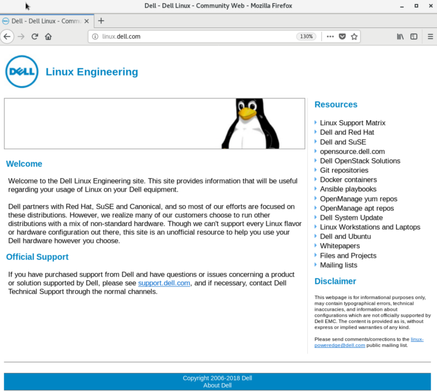

Module 09 - Linux Networking


# Exercise 1: Finding Networking Information


## IMPORTANT COMMANDS


```console
ip
nmcli
```


## Instructions


### Step 1

Log in to the **CentOS7 VM** on the first virtual terminal as `root`.


### Step 2

Use `<TAB>` autocompletion with the `ip` command to find the following information:


```console
ip <TAB><TAB>
ip -<TAB>>TAB>
ip addr <TAB><TAB>
ip link <TAB><TAB>
ip route <TAB><TAB>
```


Current IP address information.


```console
ip addr show
```


Current link information.


```console
ip link show
ip -s link show
```


Routing table information.


```console
ip route list
```


### Step 3

Use the `<TAB>` autocompletion with the NetworkManager CLI (`nmcli`) to find the following information:


All connections.


```console
nmcli connection show
```

Because `nmcli` recognizes abbreviated options and arguments `nmcli con sh` would also work.


The "status" of all devices.


```console
nmcli dev status
```


### Step 4

Use `ethtool` to find the following NIC information for `eth0`:


Driver version.


```console 
ethtool -i eth0
```


Permanent hardware address, a.k.a. MAC address.


```console
ethtool -P eth0
```


NIC offloading features. The exact list of features depends on the type of network card.


```console
ethtool -k eth0
```


### Step 5

Repeat and/or modify any parts of this lab you feel you need to practice or ask your instructor for additional practice exercises.  Notify the instructor when you have completed this lab and are ready to proceed.


# Exercise 2: Configuring Linux Networking


## IMPORTANT COMMANDS


```console
nmtui
nmcli
ip
```


## Instructions


### Step 1

Log in to the **CentOS7 VM** on the first virtual terminal as `root`.


### Step 2

Run the following script


```console
/usr/local/bin/lab-setup-net1
```


### Step 3

***SCENARIO***

You are a senior Linux administrator for a software company.  A software developer just received `sudo` privileges on his Linux dev server after completing some Linux training.  However, the feedback from the instructor of the class suggested this programmer may have spent more time answering IMs and texting than studying. Your phone rings just as your shift is about to end.  The programmer fears he has irreparably broken the network settings on the CentOS7 dev server and he desperately needs your help.  Fix the developer's mistake by restoring the network configuration settings from your detailed system records.


Correct the problems with the network configuration settings created by the inexperienced admin.

There are several methods that could be used to fix this issue. Refer to `man nmcli-examples` or `man nmtui` for help.

If you choose to edit the connection configuration file(s) manually, refer to `man 5 nm-setting-ifcfg-rh`.


After correcting the configuration and applying the updated settings, test the functionality of your network by opening https://linux.dell.com in Firefox. 


Adding connection profile for `eth0` using static IPv4 configuration.


```console
nmcli connection add type ethernet con-name eth0 ifname eth0 ipv4.method manual ipv4.address 192.168.0.200/24

nmcli connection modify eth0 connection.autoconnect yes

nmcli connection eth0 up

nmcli connection
```


Testing connectivity to https://linux.dell.com using Firefox.





### Step 4

Repeat and/or modify any parts of this lab you feel you need to practice or ask your instructor for additional practice exercises.  Notify the instructor when you have completed this lab and are ready to proceed.


# Exercise 3: Basic Firewall Configuration


This exercise is optional.


## IMPORTANT COMMANDS


```console
firewall-cmd
```


## Instructions


### Step 1

Log in to the **CentOS7 VM** as `root`.


### Step 2

Using the `firewall-cmd` command, try to get information about which zone is the default firewall zone.


*NOTE: The `firewalld` service must be running for `firewall-cmd` to work.  If the service needs to be started or enabled, refer to `systemctl --help` as needed.


* Refer to `firewall-cmd --help` for help.
* Remember that `firewall-cmd` uses `<TAB>` auto-completion. Try `firewall-cmd --get-<TAB><TAB>`.


```console
firewall-cmd --get-default-zone
```


### Step 3

List all of the ports and services configured for the `public` zone.


```console
firewall-cmd --list-all --zone=public
```


### Step 4

Permanently add the `http` service to the default zone


Refer to EXAMPLES section within `firewall-cmd` man page.


```console
firewall-cmd --permanent --add-service=http --zone=public
```


### Step 5


Run `firewall-cmd --list-all` again to see if the firewall has been updated.  Notice that changes made with the `--permanent` option are added to the *startup* configuration but are NOT applied to the runtime configuration.


### Step 6

Make your changes active one of two ways:


```console
firewall-cmd --reload ; firewall-cmd --list-all
firewall-cmd --add-service=http ; firewall-cmd --list-all
```


### Step 7

Repeat and/or modify any parts of this lab you feel you need to practice or ask your instructor for additional practice exercises.  Notify the instructor when you have completed this lab and are ready to proceed.


