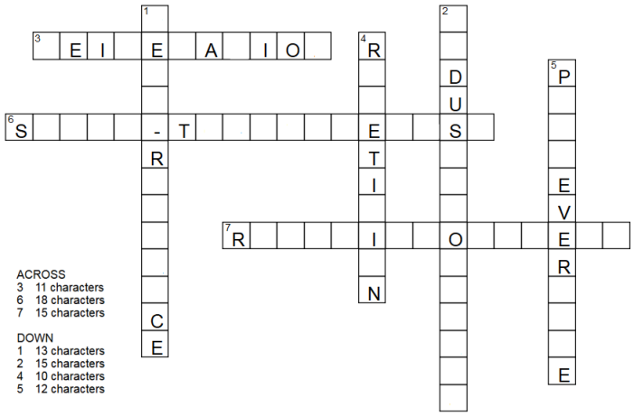

Module 03 - Working with Files


# Exercise 1: Managing Files and Directories


## IMPORTANT COMMANDS


```console
ls
cp
mv
zcat
mkdir
file 
```


## Instructions


### Step 1

Log in to the **CentOS7** VM on the third virtual terminal ( `/dev/tty3`) as user `student`. Use `<CTRL>+<ALT>+<F3>`.


### Step 2

Run the command `/usr/local/bin/lab-setup-files1`

```console
lab-setup-files1
```

Output:
```console
Creating files in /home/student/labfiles...
Files created in /home/student/labfiles
```

Display all the files in the  `~/labfiles/` directory sorted by size

```console
ls -AlhS /home/student/labfiles/
```

The setup script creates several files of different types and sizes in the `/home/student/labfiles` directory. You will need to create some subdirectories to organize these files based on their size or other attributes. Check your work as you make changes by running the grading script `/usr/local/bin/lab-grade-files1`.


### Step 3

Organize the files as instructed:

 

#### 3.1 

Create a subdirectory at `/home/student/labfiles/bigfiles` and MOVE all files **>=2MB** into this directory.
    
*HINT: Remember `ls –S` to sort by size and `ls –a` or `ls -A` to show hidden files.*
    
```console
cd ~/labfiles
ls -lhSa
mkdir bigfiles
mv blob[2-4] Stones.jpg bigfiles/
```

Alternative solution (advanced, automated):
    
```console
find . -maxdepth 1 -type f \( -size +2M -o -size 2048k \) \
    -exec mv -v '{}' bigfiles \;
```


#### 3.2

There are hidden text files compressed using `gzip` . Use `zcat` to read one of them. RENAME ( `mv` ) the largest of the hidden gzipped text files to `unhidden0.txt.gz`
    
```console
zcat .hidden4.txt.gz
find . -maxdepth 1 -name '.*.gz' -ls
mv .hidden0.txt.gz unhidden0.txt.gz
```


    
#### 3.3 

Create a subdirectory at `/home/student/labfiles/tinyfiles/` and COPY all remaining files **<=1.6KB** into this directory.
    
```console
mkdir tinyfiles
cp .hidden* document* tinyfiles/
```
    
Alternative solution (advanced, automated)
    
```console
find . -maxdepth 1 -type f \( -size -1600c -o size 1600c \) \
    -exec cp -v '{}' tinyfiles/ \;
```


#### 3.4

Create a hidden subdirectory at `/home/student/labfiles/.secretsauce`

* Use the file command to determine the type of all non-hidden files in `/home/student/labfiles`
* MOVE any non-hidden files that are not a JPEG, not ASCII text, and not a directory into `.secretauce`


```console
mkdir ~/labfiles/.secretsauce
file ~/labfiles/*
mv blob1 unhidden0.txt.gz .secretsauce/
```


### Step 4.

Run the command `lab-grade-files1` to verify you have successfully completed this exercise.

```console
lab-grade-files1
```


* Correct any errors and run the grading script again until you are successful.

* Repeat the setup script if you want to start over or practice the exercise again.

* Repeat and/or modify any parts of this lab you feel you need to practice or ask your instructor for additional practice exercises. Notify the instructor when you have completed this lab and are ready to proceed.


# Exercise 2: Using Globbing and Brace Expansion


## IMPORTANT COMMANDS 

```console
mv
man
touch
```


## Instructions

### Step 1

Log in to the **CentOS7 VM** as `student`


### Step 2

**SCENARIO**

You are a producer for UHF-Tube, a small video streaming service known for low budget knock-offs of popular blockbuster movies. You have already filmed a Science Fiction action/adventure trilogy with a working title of "Epic SciFi Miniseries." To help decide on a title, you ask your advertisers which mini-series they would rather sponsor, and give them 6 choices:

* Star Battle 1-3
* Star Journey 1-3
* Star Quest 1-3
* Space Battle 1-3
* Space Journey 1-3
* Space Quest 1-3


Use brace expansion to create 18 files in `/home/student/Videos` with the following command:


```console
touch ~/Videos/{Star,Space}_{Battle,Journey,Quest}_{1..3}.mp4
```

Examine the file names created in `/home/student/Videos/` and choose a favorite series name.

This guide will use *"Star Quest"* for an example

Use globbing to match patterns in file and directory names, including those more specific than the simple asterisk wildcard. Move all the files other than the series title you chose into `/home/student/labfiles` in case you want to use one of them for your next low budget SciFi miniseries that you will be shooting next weekend.


* Refer to the **GLOB(7)** manual page for help by running `man 7 glob` in another terminal
* If this manual page is not available, install it as root with `sudo yum -y install man-pages`
* Remember `mv` accepts multiple source arguments if the last argument for the destination is a directory

```console
cd ~/Videos
mv Space* Star_[BJ]* ~/labfiles/
```


***QUESTION***

Which globbing did you use? Was there a more efficient way to complete the task?


***Note***: Many Linux and Unix administrators avoid spaces in file and directory names because they require quoting or escaping. Rename the remaining files in `/home/student/Videos/` so that each underscore is replaced with a space.


* You may choose to use quoting OR escaping to accomplish this task

```console
mv Star_Quest_1.mp4 Star\ Quest\ 1.mp4
mv Star_Quest_2.mp4 "Star Quest 2.mp4"
mv Star_Quest_3.mp4 'Star Quest 3.mp4'
```

### Step 3

Repeat and/or modify any parts of this lab you feel you need to practice or ask your instructor for additional practice exercises. Notify the instructor when you have completed this lab and are ready to proceed.


# Exercise 3: Using Simple Regular Expressions


## IMPORTANT COMMANDS

```console
cp
man
grep
```

## Instructions


### Step 1

Log in to the **CentOS7 VM** as `student`.


### Step 2

Copy the file `/usr/share/dict/words` to your home directory. If this file is missing, install the package (`words`) that provides it.


```console
su -c "yum -y install words"
cp /usr/share/dict/words ~
```

### Step 3

Open the manual page for Regular Expressions with `man 7 regex` and pay special attention to paragraphs that mention **"bracket expression"** and **"character class"**.


*PRO TIP*: Manual pages are viewed through the `less` text pager.  Use `less` key strokes for navigation and search. If this manual page is missing, run:

```console
su -c "yum -y install man-pages ; mandb"
```


### Step 3

Switch to the another terminal ( e.g. `/dev/tty2` with <CTRL>+<ALT>+<F2> ) and log in as `student`

### Step 4

Use `grep` to search the file `/home/student/words` for words that match the following criteria:


Words that begin with a vowel and contain a hyphen of any length.

```console
grep '^[aeieou].*-.*' /home/student/words
```

Notice that to match zero of more of any character, the RegEx is `.*` and NOT just `*`


Words that begin with either `f` or `F` and end in `z` or `Z` of any length.

```console
grep '^[fF].*[zZ]$' /home/student/words
```


Words that begin with `anti` and end with `ism`that are exactly 13 characters long.

```console
grep '^anti......ism$' /home/student/words
```

While this works, it would be better form to use a "bound." See man **grep(1)** and read "Repetition" for examples.

Using basic regex symbol set:
```console
grep '^anti.\{6\}ism$' /home/student/words
```

Note the need to escape the curly braces that would otherwise be matched literally in Basic Regex.

Using extended regex symbol set:

```console
grep -E '^anti.{6}ism$' /home/student/words
egrep '^anti.{6}ism$' /home/student/words
```

See man **grep(1)** and read "Basic vs Extended Regular Expressions" to see which characters are literals in Basic and special in Extended symbol set.
Repeat the previous regular expression search used in the previous step and pipe ( `|` ) that output through another regular expression using a character class that will exclude any words containing upper case letters.


* Use either a range like `[A-Z]` or a "Character Class" like `[[:upper:]]` and the `-v` option for `grep`.
* There is almost always more than 1 way to perform a task in Linux. Below are 3 examples to do the same thing:


You can save keystrokes and avoid typos using your history via the UP arrow or a history expansion (`!!`).

```console
!! | grep -v '[[:upper:]]'
```

***REMEMBER***:  Typing `!!` will perform a history expansion of the most recent command.


```console
grep '^anti.\{6\}ism$' /home/student/words | grep -v '[[:upper:]]'
```

```console
grep -E '^anti.{6}ism$' /home/student/words | grep -v '[A-Z]'
```

### Step 5

Repeat and/or modify any parts of this lab you feel you need to practice or ask your instructor for additional practice exercises.  Notify the instructor when you have completed this lab and are ready to proceed.


# RegEx Bonus Activity


Using the `grep -i` command (case insensitive) and regular expressions find the words in the file `/usr/share/dict/words` that complete this puzzle.





#### RegEx Reminders:

* Most characters are a literal match for themselves.
* A dot (`.`) represents any one character.
* The `^` anchor represents the beginning of a line.
* The `$` anchor represents the end of a line.
* A repetition quantifier modifies the object that precedes it. 
    * `.*` represents 0 or more of previous character 
	* `.?` represents 0 or one of previous character
	* `[AEIOUaeiou]+` represents 1 or more vowels in upper or lower case
	* `[[:upper:]]{5}` represents exactly 5 upper case characters
	* `[0-9]{1,3}` represents at least 1 but no more than 3 digits

#### Important options for `grep`

| `grep` option | Description |
| :--- | :--- |
| `-i` | case insensitive |
| `-v` | inverse match (match lines that DO NOT contain the pattern) |
| `-E` | use Extended RegEx rather than Basic RegEx |
| `-A #` | show `#` lines of additional context after a match |
| `-B #` | show `#` lines of additional context before a match |
| `-C #` | show `#` lines of additional context before and after a match |


## Solution


3 Across

```console
grep -i '^.EI.E.A.IO.$' /usr/share/dict/words
```

6 Across

```console
grep -i '^S....-T......E..S.$' /usr/share/dict/words
grep -i -E '^S.{4}-T.{6}E..S.$' /usr/share/dict/words
grep -i '^S.\{4\}-T.\{6\}E..S.$' /usr/share/dict/words
```

7 Across

```console
grep -i '^R....I..O...E..$' /usr/share/dict/words
grep -i -E '^R.{4}I..O.{3}E..$' /usr/share/dict/words
```

1 Down

```console
grep -i '^.E..-R.....CE$' /usr/share/dict/words
grep -i -E '^.E..-R.{5}CE$' /usr/share/dict/words
```

2 Down

```console
grep -i '^..DUS...O......$' /usr/share/dict/words
grep -i -E '^..DUS...O.{6}$' /usr/share/dict/words
```

4 Down

```console
grep -i '^R..ETI.I.N$' /usr/share/dict/words
```

5 Down

```console
grep -i '^P...EVER...E$' /usr/share/dict/words 
grep -i -E '^P.{3}EVER.{3}E$' /usr/share/dict/words
```


