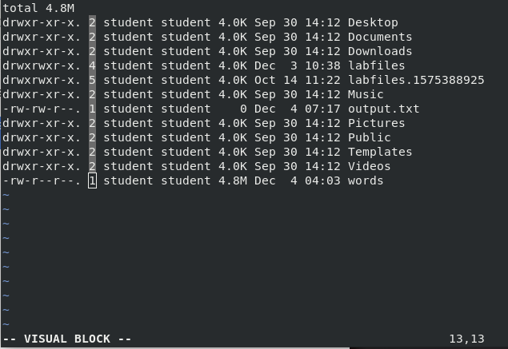
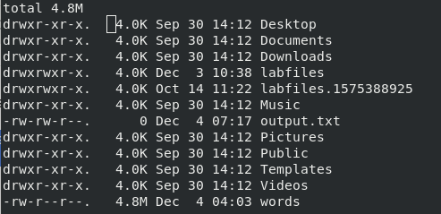

Module 05 - Text files and I/O Redirection


# Exercise 1:  Using I/O Redirection


## IMPORTANT COMMANDS

```console
ls
find
cat
less
tee
```


## Instructions


### Step 1

Log in to the **CentOS7 VM** on the first virtual terminal ( `/dev/tty1` ) as `student`.


### Step 2

Run the following commands from `/home/student/` directory.


```console
ls -lh               # no IO stream redirection
ls -lh > output.txt  # STDOUT redirected to output.txt file
```


*OPTIONAL: Check the contents of `output.txt` file after redirecting.*

```console
cat output.txt
```

Display path to all files and directories with the following permissions: `rwxrwxrwt` (octal: 1777).

```console
find / -perm 1777
find / -perm 1777 > stickydirs.txt
```


When there are more errors than useful output, it is a good idea to redirect STDERR. Errors could be redirected to a file (`stickyerr.log`) for future analysis, or discarded (`/dev/null`).


```console
find / -perm 1777 > stickydirs.txt 2> stickyerr.log
find / -perm 1777 > stickydirs.txt 2> /dev/null
```


The `tee` utility allows displaying STDOUT from the command on the left, and at the same time writing the same STDOUT content to specified file(s).


```console
find / -perm 4755 | tee suid-files.txt
```


In the above example, if `find` utility generates some messages using STDERR, those messages won't pass through a pipe. To allow passing both STDOUT and STDERR through a pipe, use `2>&1` redirection symbol.

```console
find / -perm 4755 2>&1 | tee suid-files.txt
```


Redirecting STDOUT and STDERR to the same file.

```console
find / -perm 4755 &> suid-combined2.txt
```


Using `cat` utility, use STDIN redirection symbol to read content of the file.

```console
cat < stickydirs.txt
```

The above example isn't very useful. The same operation could be performed easily just by running `cat stickydirs.txt`.

STDIN redirection (`<`) is used with some applications, e.g. `mysql` utility to restore database.

Example (do not run this !!!):

```console
mysql -u root -p  < backup.sql
```


### Step 3

Repeat and/or modify any parts of this lab you feel you need to practice or ask your instructor for additional practice exercises.  Notify the instructor when you have completed this lab and are ready to proceed.


# Exercise 2: Editing Files Using VIMs


## Important commands

```console
vimtutor
vim
vi
```


## Instructions


### Step 1

Log in to the **CentOS7 VM** on the first virtual terminal ( `/dev/tty1` )  as `student`.


### Step 2

Run `vimtutor` and work through the lessons until you complete Lesson 3.3.


```console
vimtutor
```


### Step 3

Use VIM to open the file `~/output.txt` created in the previous exercise (or create a new one with `ls -lh ~ > ~/output.txt`), then use "Visual Block" mode  to select the "link count" column.

Remember, press `<CRTL>+<v>` to enable "Visual Block" mode.

```console
vim ~/output.txt
```

Navigate cursor to location in the file from which you *select* (VISUAL mode). Press `<CTRL>-v` to enter VISUAL mode. If VISUAL mode has been accidentally activated, type `:q` + `ENTER` to leave it.




### Step 4

Delete the selected text using the `x` key.


### Step 5

Repeat the previous steps for the *owner* and *group* columns in vim, and save as `~/output2.txt` (in VI/VIM use exec mode `:wq! ~/output2.txt`).

Notice that because of using `!`, the original file (`output.txt`) has not been modified. All modifications have been saved in `output2.txt`.


After modifications, `outpu2.txt` should look similar to this.





### Step 6

*OPTIONAL:*  Open a web browser to http://vim-adventures.com and put your new skills to the test by completing levels 1 and 2.


### Step 7

Notify the instructor when you have completed this lab and are ready to proceed. 


