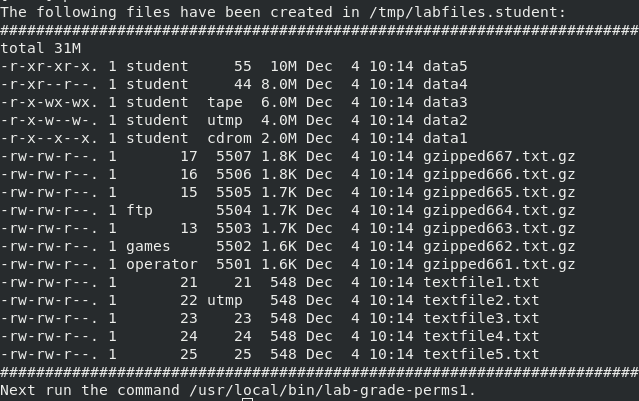
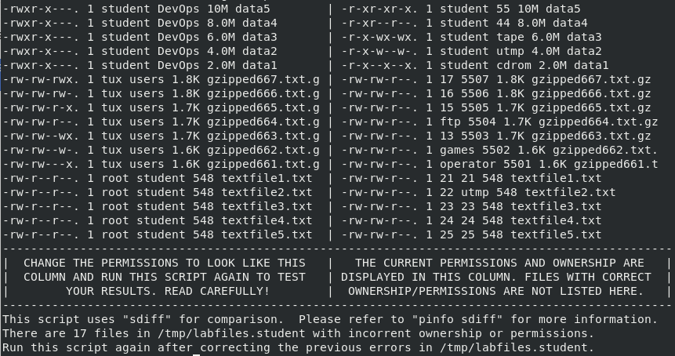
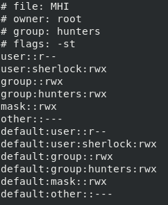

Module 07 - File System Permissions


# Exercise 1:  Working with Basic User, Group, and Other Permissions


## IMPORTANT COMMANDS


```console
chown
chmod
ls
su
sudo
```


## Instructions


### Step 1

Log in to the **CentOS7 VM** as `student`.


### Step 2

Run the command `lab-setup-perms1`. Follow the instructions in the terminal window to complete this lab activity. Some changes will require the use of `sudo` or `root` user privileges.

***IMPORTANT: Run the command `lab-grade-perms1` after each change to the files in this lab to ensure the desired results.***


You should see the following output.





### Step 3


To get further instructions, run:

```console
lab-grade-perms1
```





**Solutions**

```console
cd /tmp/labfiles.student/
ls -lh
sudo chown student:DevOps data*
sudo chmod 750 data*
lab-grade-perms1
```

```console
cd /tmp/lab/files.student/
sudo chown tux:users gzipped*
for i in {661.667}; do sudo chmod -v $i gzipped${i}.txt.gz ; done
sudo chown -v root:student textfile
```

Run `lab-grade-perms1` for the last time. You should receive message that this lab exercise has been completed. If that's not the case, review the tasks and correct it.


# Exercise 2: Using Special Permissions and Setting Default Permissions


## IMPORTANT COMMANDS


```console
mkdir
umask
vim
chown
chmod
```


## Instructions


### Step 1

Log in to the **CentOS7 VM** as `root`.


### Step 2

Become the `tux` user.

```console
su - tux
```


### Step 3

As user `tux` show default UMASK value.

```console
umask -S        # symbolic notation
umask           # octal notation
```


### Step 4

Modify the UMASK only for the user tux to be `023`.

As user `tux` modify `~/.bashrc` file. At the end of this file add the following line.

```console
umask 023
```


### Step 5

Log out of the tux account, and `su - tux` again to make the change take effect.

*QUESTION*:  What permissions will new files and directories created by user `tux` have?

*ANSWER*:

Files: `-rw-r--r--` (644 octal) 
Directories: `drwxr-xr--` (754 octal)


### Step 6

Creating file and directory as user `tux` and verifying default permissions.


```console
touch newfile
mkdir newdir
ls -ld new*
```


### Step 7

Create a directory called `/DevOps` and set the ownership and permissions to look like this example:


```console
drwxrws--T. 2 tux DevOps 4096 MMM DD HH:MM DevOps
```

*Remember*: `chown --help` and `chmod --help` as well as the manual pages.


As user `root` create `/DevOps` directory


```console
mkdir /DevOps
```

To set above permissions on `/DevOps` directory we can use either octal or symbolic notation.

Octal notation:

```console
chmod 3770 /DevOps/
```

Symbolic notation:

```console
chmod u=rwx,g=rwxs,o=t /DevOps/
```


### Step 8

Repeat and/or modify any parts of this lab you feel you need to practice or ask your instructor for additional practice exercises.  Notify the instructor when you have completed this lab and are ready to proceed.


# Exercise 3: Using Access Control Lists, Special Permissions, and Umask


***NOTE:***  THIS ADVANCED LAB IS OPTIONAL


## IMPORTANT COMMANDS


```console
mkdir
chown
chmod
getfacl
setfacl
```


## Instructions


### Step 1

	
Log in to the **CentOS7 VM** as `root`.


### Step 2

Run the command `/usr/local/bin/lab-setup-perms2`.


### Step 3

***SCENARIO***

You are the server admin for a group of *Monster Hunters*.  The team needs a collaborative directory where they can share information and work together on cases.  Your mission is to make the directory work precisely as they have requested.


The collaborative directory must meet the following criteria:

* The directory must have an absolute path of `/MHI`

```console
mkdir /MHI
```

* It must belong to the user `root` and the group `hunters`

```console
chown root:hunters /MHI
```

* The `root` user must have read permission ONLY (r--) on `/MHI`

```console
chmod u=r /MHI
```

* The group `hunters` must have read, write, and execute permissions (`rwx`)

```console
chmod g=rwx /MHI
```

* New files and directories must be owned by the user that created them and the group (use SGID) `hunters`

```console
chmod g+s /MHI
```

* Users must not be able to delete other users' files (use sticky bit)

```console
chmod o+t /MHI
```

What would be octal representation of all those permissions?

```console
3470
```


* Members of the group `hunters` must have full access to files created by other users. The directory `/MHI` must also have a default ACL that grants the owner read permission ONLY (`r--`).

```console
setfacl -m d:u::r,u::r /MHI
setfacl -m d:g:hunters:rwx,g:hunters:rwx /MHI
```

* The user `sherlock` must always have full access for all files and subdirectories

```console
setfacl -m d:u:sherlock:rwx,u:sherlock:rwx /MHI
```

* The user `sherlock` must not be a member of the `hunters` group

```console
gpasswd -d sherlock hunters
```

* All files/directories created by `sherlock` must have permissions of `640`/`750` respectively.

```console
echo 027 | tee -a ~sherlock/.bashrc ~sherlock/.bash_profile
```

* All other users must have no access

```console
setfacl -m d:o::-,o::- /MHI
```


### Step 4

Verify your success by running `/usr/local/bin/lab-grade-perms2`. The output of the command getfacl /MHI should look like the following example.


```console
getfacl /MHI
```




