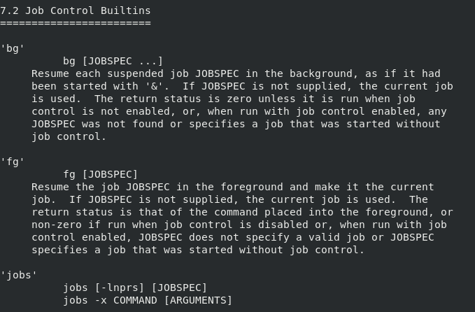
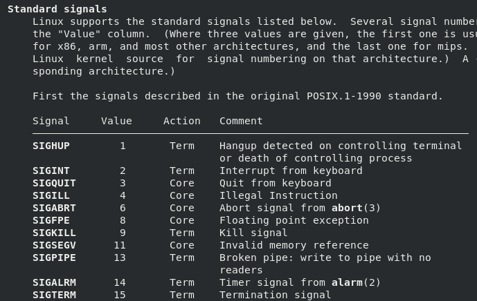

Module 09 - Managing Processes


# Exercise 1: Shell Job Control


## IMPORTANT COMMANDS


```console
sleep
jobs
bg
fg
vim
ip
```


## Instructions


### Step 1

Log in to the **CentOS7 VM** as `root`.


### Step 2

Run the command `pinfo bash` then navigate to the **Job Control::** node. Next open **Job Control Builtins::** and to look up how the built-in commands `jobs`, `bg`, and `fg` work. 





### Step 3

Run the command `sleep 10` and wait for the command prompt. The `sleep` command does what it sounds like - it just sleeps for X seconds then exits.


### Step 4

Run the command `sleep 1000` then use `<CTRL>+<z>` to suspend the process.


### Step 5

Run the command `jobs` to view the stopped job.


### Step 6

Run the command `bg %1` to resume the process in the background.


### Step 7

Run the command `sleep 5000 &`.


### Step 8

Run `jobs` again and notice the job numbers as well as the `+` and `-`.

* The `+` indicates the most recently used shell job.

In documentation the job number is often referred to as the ***jobspec***.


### Step 9

Open a new file with the command `vim ipinfo.txt`.


### Step 10

Suspend `vim` by pressing `<CTRL>+<z>`.

*NOTE*:  Make sure VIM is in *command mode* when pressing `<CTRL>+<z>`.


### Step 11

Run the command `ip addr show eth0` to find the first IP address used by the NIC.


*NOTE: the IP address doesn't matter - pausing and resuming the program are what matter for this exercise*


### Step 12

Run `jobs` to find the job number (*jobspec*) of the stopped `vim` editor.


### Step 13

Run `fg <jobspec>` to resume the stopped `vim`.


### Step 14

Enter the IP address and save the file.


### Step 15

Run `jobs` and terminate any jobs that are still running.


```console
kill %<jobspec>
```

You may choose to bring jobs to the foreground with `fg` and then interrupt them with `<CTRL>+<c>`.


### Step 16

Notify the instructor when you have completed this lab and are ready to proceed.


# Exercise 2: Sending Signals and Interpreting Process Related Information


## IMPORTANT COMMANDS


```console
top
ps
nice
renice
kill
```


## Instructions


### Step 1

Log in to the **CentOS7 VM** on the first and second virtual terminals ( `/dev/tty1` and `/dev/tty2`) as `student`.


### Step 2

On the first terminal run this command.


```console
cat /dev/zero > /dev/null &
```


### Step 3

On the second terminal run `top` command to find the nice level (default 0) (`NI` column) of the `cat` command from the previous step.

*NOTE: `cat /dev/zero` process will use CPU intensively. `top` should display this process as one of the first ones in the process list.*


### Step 4

Switch back to the first terminal and use `ps aux` to find the PID of the `cat` command.


```console
ps aux | grep 'cat '
```

Alternative solution:

```console
pgrep -t tty1 cat
```


### Step 5

Use the `renice` command to increase by 10 the niceness of the running `cat` command.


***QUESTION***: Were you able to raise the niceness?  What is the new PRIORITY (`PR` column)?

You can see the changes using the instance of `top` running on the second terminal.


```console
renice --help
renice -n 10 <PID>
```

Alternative solution (if there's only single instance of `cat` running on `tty1`):

```console
renice -n 10 -p $(pgrep -t tty1 cat)
```


### Step 6

Use the `renice` command to decrease by 5 the niceness of the running `cat` command.


***QUESTION***: Were you able to lower the niceness?  Did the PRIORITY change?


You can see the changes using the instance of `top` running on the second terminal.


```console
renice -n 5 <PID>
```


### Step 7

Find the different signals you can send to processes.


```console
kill -l
```


More information on available signals.


```console
man 7 signal
```





### Step 8

Use the `kill` command to terminate the running `cat` command.


```console
kill <PID>
```

Alternative solutions:

```console
pkill -t tty1 cat
kill $(pgrep -t tty1 cat)
```


### Step 9


Start new `cat /dev/zero` process with nice value of 5. If nice value isn't specified, it defaults to 10.


```console
nice -n 5 cat /dev/zero > /dev/null &
```


### Step 10

Switch to the second terminal and use `top` to verify the nice level of the new running `cat` process.


### Step 11

Within `top` utility, use the `r` key to renice the process to a niceness of `19`.


### Step 12

Within `top` utility, use the `k` key to kill the `cat` process with the default signal of `SIGTERM`.


### Step 13

Notify the instructor when you have completed this lab and are ready to proceed.


